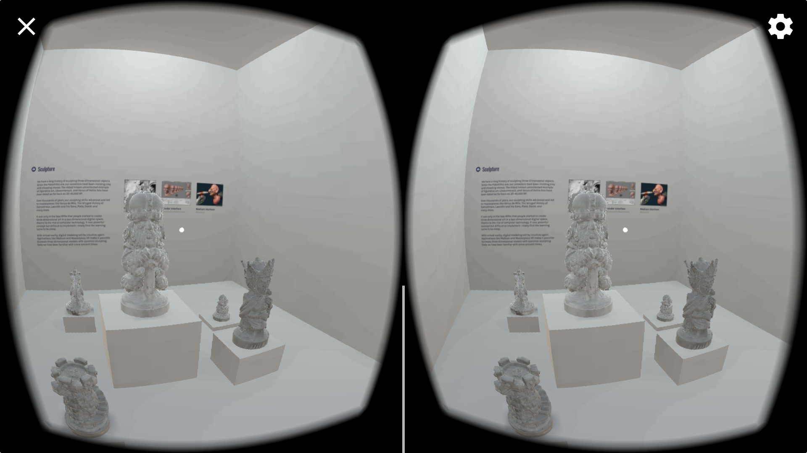

## VR Museum

This is a project for Udacity Nanodegree program, made by Samantha Zhang, voiceovered by Yisi Lu.

Video Walkthrough: [https://youtu.be/8wpL7rX-_S0](https://youtu.be/8wpL7rX-_S0)

### Platform

* Unity 2017.1.0p4

* Google VR SDK v1.60.0

### Models Used

* King by eric3dee: [https://sketchfab.com/models/aaacd1b76b52426b9bc4057b58abcef2](https://sketchfab.com/models/aaacd1b76b52426b9bc4057b58abcef2)
* Queen by eric3dee: [https://sketchfab.com/models/f87228475a8d41a88cda39d0705518e6](https://sketchfab.com/models/f87228475a8d41a88cda39d0705518e6)
* Bishop by eric3dee: [https://sketchfab.com/models/2d7cae0bc0d946e0abd316f583010cef](https://sketchfab.com/models/2d7cae0bc0d946e0abd316f583010cef)
* Knight by eric3dee: [https://sketchfab.com/models/3d6058c54b674662863607e9960bdbe8](https://sketchfab.com/models/3d6058c54b674662863607e9960bdbe8)
* Pawn by eric3dee: [https://sketchfab.com/models/a867200d9a154737bcf18646746c4272](https://sketchfab.com/models/a867200d9a154737bcf18646746c4272)
* Rook by eric3dee: [https://sketchfab.com/models/f9f48c0dc5174309b45176594dc86c97](https://sketchfab.com/models/f9f48c0dc5174309b45176594dc86c97)
* Halloween Horror Maze Center Figure by Rein Bijlsma: [https://sketchfab.com/models/1b4f64aecb024a83a514a2fb0c5582b4](https://sketchfab.com/models/1b4f64aecb024a83a514a2fb0c5582b4)
* Tree Scene by Elizabeth Edwards: [https://sketchfab.com/models/5368efef04cc494390bfdc83bcf11f96](https://sketchfab.com/models/5368efef04cc494390bfdc83bcf11f96)
* Donut by Florence D: [https://vr.google.com/objects/9iR3Pmgujnt](https://vr.google.com/objects/9iR3Pmgujnt)
